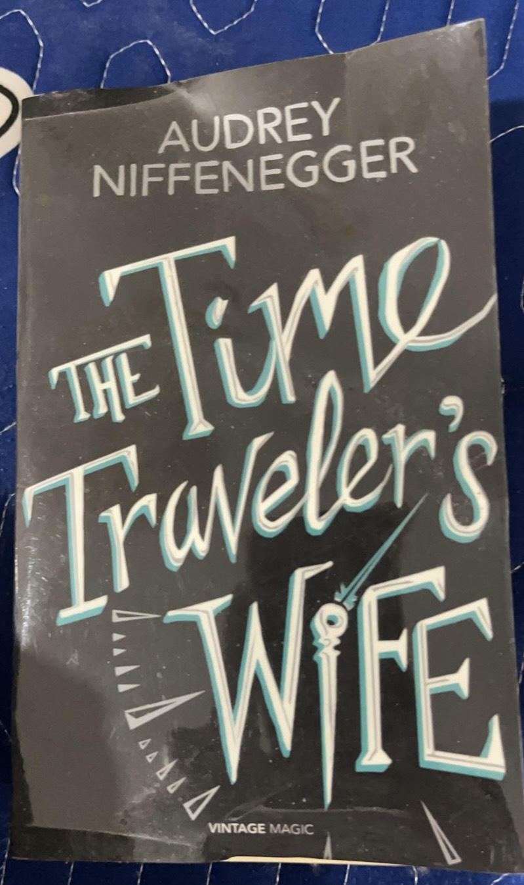

I recently tried to put myself in a habit of reading (of course) books instead of spending hours every day scrolling my phone (ofc, playing tiktok). I was not much of a reading person, but I'm working on that. I finished a couple of books this year, but this one is a special one; partly because of the book content, mainly because I bought this book back in 2014! That was more than a decade. I thought the book might decompose before I actually complete it; however I did manage to. By the way, this blog and all my future blogs are AI-free, so expect to see typos, grammar mistakes and etc.

{width=300px style="float:right; margin-left:1em; margin-bottom:1em;"}

A little spoiler alert! The main characters of the story are Clare Abshire --- the wife --- and Henry DeTamble --- the husband. Henry, for some reason, can time travel more likely back in time rather in the future. The explanation the writer gave was some sort of genetics complications. And the story was developed upon such concept. 

I sometimes find time traveling stories confusing. However, this book rarely got me confused. I think it has to do with how explicit the writer (and the editors) put the story. The book includes the date and the age to each and every scene. I googled and saw that the author --- Audrey Niffenegger --- is an American writer and artist, which I believe is the reason why the character Clare is so art-obsessed. I am not an art aficionado so I skimmed when the story describes all sort of incomprehensible art. 

Anyone can guess that this book is a romantic story which has its twists and turns from Henry's time traveling. He doesn't know when and where he'll end up at; wherever or whenver that happens he would end up naked! Poor Henry. And it's interesting what he has to do in such circumstances. Aside from that there are a couple of coitus (credit: Sheldon Cooper) scenes. Henry sometimes visit Clare when she's under 18. Of course, morally behaved Henry does not commit any (quote unquote) coitus with underage Clare.

For those who like fast-paced, convoluted, plot-twisty stories, this book may not be for you. What you would find here is very detailed depiction (although not chronological) of how their love develops, with obstacles along the way. Imagine meeting your soulmate when you were 7 years old, imagine not being able to see, talk with your love for years, and many more. What I like most about this book is how such a seemingly very romantic story can have a very brutal twist and ending, although I prefer stories with more of such (I love thriller). Personally, I'm not a big fan of romantic stories, but this book did get tears in my eye at the end.

Would I buy romatic books next? Probably not. Sometimes, you try something new just for the sake of exploration whether you like it or not (just like when I tried durian and I realized that it is awful). Would I recommend this book to others? Probably, if they fancy romantic, sci-fi. What I'd loved to see more from this book is more superstitious stuff! Although its title is Time Traveler's Wife, other than time-travelling just feels too ordinary. There's actually a book (or books) that is a sequel of this book. I will put that in the queue. Of course, the next book in my queue is a thriller.